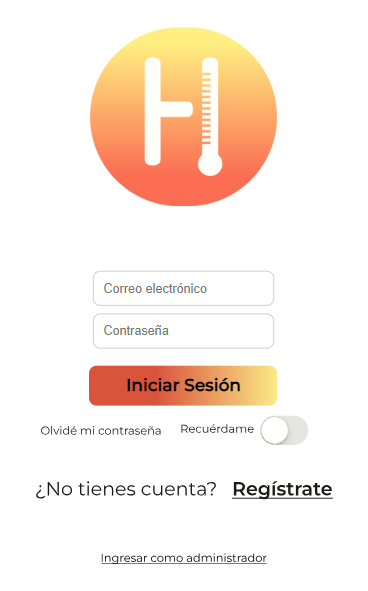
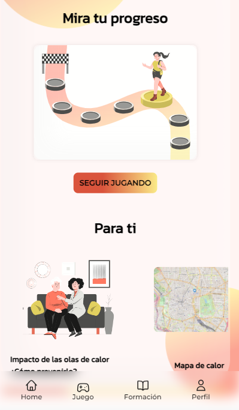
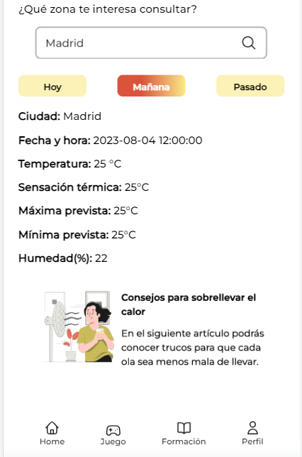
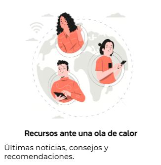
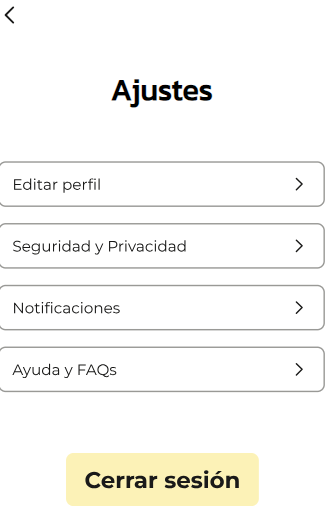

# Desafio-Tripulaciones

Bienvenidos al proyecto de Desafio de Tripulaciones de la promoción de Abril 2023!

Hemos creado una aplicación web enfocada a la ola de calor desde un ámbito educativo e interactivo

La hemos llamado Heaty!

Para poder visualizar nuestro proyecto teneis 2 opciones:

1. Podeis ver nuestro proyecto a través del enlace que les dejo a continuación, esta completamente desplegado y funcional en Google Cloud y asi podreis navegar por el proyecto sin necesidad de instalar nada en vuestro ordenador:

    - https://mi-servicio-client-u4ktx3b6jq-ew.a.run.app

2. Si quereis clonar el repositorio y realizar pruebas vosotros mismos en el código, podeis seguir los siguientes pasos:

    - Para iniciar el proyecto una vez que hayas clonado el repositorio (en caso de que quieras probarlo) debes instalar las dependencias, utiliza el siguiente comando en tu terminal:

        - npm run install ¡Esto instalará todo lo necesario para que el proyecto arranque!

    - A continuación, utilice el siguiente comando para iniciar el proyecto:

        - npm run dev Ahora podrás navegar por el siguiente puerto configurado en tu configuración regional:

    - http://localhost:5173/

3. A continuación vamos a explicar paso por paso las funcionalidades implementadas en la aplicación:

    - En primera vista que se ve, se trata de un formulario de inicio de sesión, podeis registraros haciendo click en Registrate si es la primera vez que entrais, cuando termineis de rellenar el formulario y registraros estos datos se envian a nuestra Base de Datos SQL, no se preocupen esta encriptado con Bcrypt y utilizamos autentificación con Json Web Token.

        

    - Una vez completado el registro llegareis a Home donde hay diferentes secciones, si haceis click en seguir jugando podreis realizar el quiz interactivo que hemos incluido con preguntas sobre la ola de calor, antes se mostrará una lección para preparse un poco.

         

    - Mapa de calor si haceis click en la siguiente sección os llevará a otra vista donde la cual si permitis la localización se mostrar un mapa con vuestra geolocalización y podreis ver datos meteorologicos justo debajo, podeis hacer click en hoy, mañana y 2 días para informaros del tiempo

        

    - Podeis navegar utilizando la barra de navegación implementada en el Footer para ir a las diferentes secciones de la página

    - Si haceis click en Formación tendreís esta vista y cada una de estas secciones tiene navegación para llevarte a otros puntos de la aplicación, por ejemplo: Profesora virtual es un chatbot interactivo que utiliza la API de chatGPT para que le preguntes lo que quieras sobre la ola de calor, luego tienes al Mapa y información meteorólogica y por último recursos:

        
        

    - Si navegas hasta la parte de Perfil (recomiendo hacerlo una vez hayas jugado una partida del Quiz) podrás ver más información de tu partida o partidas en una grafica, estas partidas se almacenan en una base de datos y en esta parte se accede a esta información, puedes hacer click en el boton colocado en el margen superior derecho para cerrar sesión si lo deseas:

        

    - Ten en cuenta que solo funciona el boton de cerrar sesión o la flecha de volver al perfil, los otros botones estan desactivados por el momento para una futura versión.

    Se puede acceder a la primera parte de la presentación visual del proyecto desde el siguiente enlace: https://drive.google.com/file/d/1D5rkPbWvOwHo7AcqMf6N6j4Bvj_WiqEi/view?usp=sharing